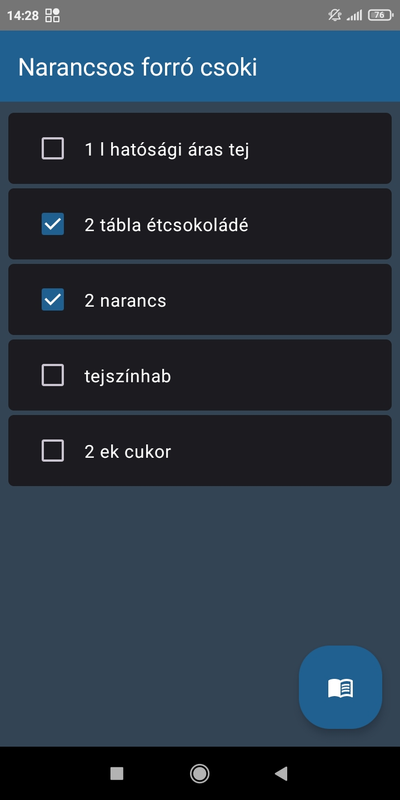

# Dokumentáció

## Androidalapú szoftverfejlesztés
### 2023.04.30. - 2023 1. félév
### Varga Eszter

### CookBook

## Bemutatás

Egy recepteskönyv alkalmazás, amely receptek tárolására alkalmas. A receptekből automatikusan bevásárlólista készítésre képes, hogy a felhasználó biztosan ne felejtsen el egy hozzávalót se beszerezni.

## Főbb funkciók

 * Az alkalmazás receptek tárolására, szerkesztésére képes.
 * Az elkészült recept hozzávalóiból bevásárlólista generálására képes.
 * A megjelenítés témája a főoldalon a teljes alkalmazásra kiterjedően állítható.
 * Az alkalmazásban tárolt recept más alkalmazással megosztható.
 * (Az egyes receptekhez galéria engedély megadása esetén képek csatolhatóak. - A specifikációban szerepelt, de idő hiányában nem lett implementálva.)

## Felhasználói kézikönyv
Az alkalmazás megnyitása rövid loading animációval indul, majd automatikusan átlép a főoldalra. Az innen elérhető fő funkciók:
 * Az alkalmazás témájának állítás a lightTheme/darkTheme ikonra kattintva.
 * Új recept létrehozása a jobb alsó sarokban lévő FloatingAction Buttonra kattintva.
 * Az összes tárolt recept törlés, a RecycleBin ikonra kattintva.
 * Már létező recept megtekintése, a recept listaelemére kattintva.
 * Recept tartalmának küldése más alkalmazáson keresztül, a recept listaelemét hosszan megnyomva.
Az alkalmazás témájának állítása

Recept létrehozásakor megadhatjuk az étel nevét, legördülő listából kiválaszthatjuk a kategóriát (például kávé, sütemény, stb.), megadhatjuk a hozzávalókat vesszővel elválasztva, valamint az elkészítés módját.

Egy recept megnyitásakor három dolgot tehetünk: megtekinthetjük a tartalmát, szerkesztése azt,  és bevásárlólista készíthetünk, emelyen jelölhetjük a már megvásárolt termékeket.

## Felhasznált technológiák:

- UI: A felhasználói felület Jetpack Compose-ban és MVVM architektúrával.
- Lista: A receptek egy-két fontosabb részlettel együtt egy komplex listában jelennek meg. 
- Stílusok/témák: Az alkalmazás témaája állítható a főoldalon teljes alkalmazásra kiterjedően.
- Adatbáziskezelés: A felhasználó elmentheti a receptek hozzávalóit és elkészítési módját, amit az alkalmazás perzisztensen tárol.
- Animáció: Az alkalmazás egy betöltés animációval indul, az animáció nem kerül a back stack-re.

Itt kell felsorolni minden technológiát, technikát, külső könyvtárat, komplexebb algoritmust, ami növeli az alkalmazás értékét. Osztályzáskor ezt a fejezetet nézzük meg először.

Külső osztálykönyvtár használata esetén a könyvtár neve legyen link, ami annak elérhetőségére mutat.

A kulcsszavak legyenek **félkövér** betűtípussal szedve.
Például:

- •	Az X és Y képernyők optimalizáltak **álló és fekvő nézetre** is
- [YCharts](https://github.com/yml-org/YCharts) osztálykönyvtár használata a grafikonok rajzolására
- **Fused Location API** használata helymeghatározásra
- **SQLite** alapú adattárolás
- Implicit intent használata **QR kód beolvasáshoz** (telepített Barcode Scanner alkalmazás szükséges a futtatásához)
- A játék fizikáját a [Box2D](https://box2d.org/) motor biztosítja
- **Service** használata zenelejátszáshoz
